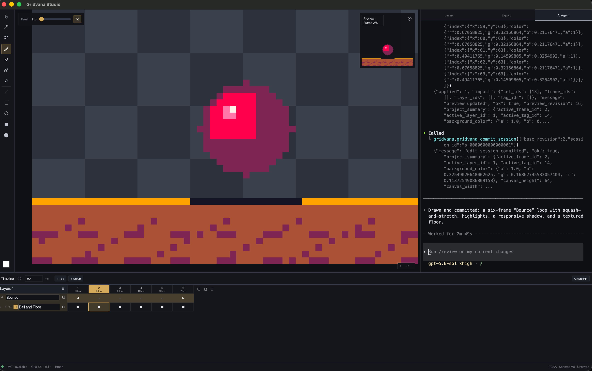

<h1 align="center">
  
  Gridvana
</h1>

Gridvana is a collaborative pixel art and animation editor written in Rust.
Humans and AI agents share the same square pixel grid, creating and revising
frame-by-frame artwork together through MCP.



## Features

- **Drawing tools** — brush, eraser, paint bucket, color picker, line, rectangle
  and ellipse (filled or hollow), magic wand, and color select.
- **Selections & transforms** — box selection with implicit combine modes
  (Shift add, Alt subtract, Shift+Alt intersect), on-canvas move/scale/rotate
  handles, and floating pasted selections.
- **Animation** — timeline with frames, layers, tags, and a live preview panel.
- **Export** — PNG, animated GIF, and sprite sheets.
- **Human-AI collaboration** — a built-in MCP server plus an embedded terminal
  let AI agents edit the same project as you: they can start an edit session,
  preview operations, and commit changes into the shared undo history.

## Building

```bash
cargo build --workspace
cargo test --workspace
cargo run --package app
```

## Opening Gridvana on macOS

macOS may report that Apple cannot verify Gridvana for malicious software. If
you downloaded Gridvana from a source you trust:

1. Find `Gridvana.app` in Finder.
2. Control-click the app and choose **Open**.
3. Click **Open** again in the confirmation dialog.

If **Open** is not available, try launching Gridvana once, then open **System
Settings > Privacy & Security**, find the message that Gridvana was blocked,
and click **Open Anyway**.

As a last resort, move Gridvana to the Applications folder and run:

```bash
xattr -dr com.apple.quarantine /Applications/Gridvana.app
open /Applications/Gridvana.app
```

Only remove the quarantine attribute when you trust the download source. There
is no need to disable Gatekeeper globally.

## Project layout

| Crate   | Description                                                        |
| ------- | ------------------------------------------------------------------ |
| `core/` | Document model, grid system, compositing, transforms, persistence |
| `app/`  | The desktop GUI application                                         |
| `mcp/`  | MCP server enabling AI agents to edit the shared project             |

## License

Gridvana is licensed under the [GNU General Public License v3.0](LICENSE) or
later.
